# PL/O 简易编译器的实现

该实验PL/O编译器结构满足PL/0 语言的文法规范， 目的为应课题要求，完成课业任务，结合上海大学《编译原理课程-实验指导书》，实验项目如下：

## 目录

* [实验一 ：识别标识符](#标识符的识别)
* [实验二 : 词法分析](#词法分析)
* [实验三 ：语法分析](#语法分析)
* [实验四 ：语义分析](#语义分析)
* [实验五 ：中间代码生成](#中间代码生成)
* 实验六 ： 代码优化

> 项目框架

本项目采用MAVEN搭建，环境为JDK14，IntelliJ IDEA 2019.3.4 (Ultimate Edition)，测试环境JUNIT5

@Author : 白皓天

@ID ：17121444

@Institution ： 上海大学计算机工程与科学学院

@Major ： 计算机科学与技术

## 标识符的识别

### 实验内容

输入 PL/0 语言源程序，输出源程序中所有标识符的出现次数。

### 实验要求

* 识别程序读入 PL/0 语言源程序（文本文件），识别结果也以文本文
  件保存。
* 按标识符出现的顺序输出结果， 每个标识符一行， 采用二元式序列，
  即： (标识符值, 标识符出现次数)
* 源程序中字符不区分大小写，即：“a1” 和“A1” 是同一个标识符。
* 准备至少 5 组测试用例，每组测试用例包括：输入源程序文件和输
  出结果。
* 测试用例应该考虑各种合法标识符的组合情况。

### 输入输出样例

输入： （文本文件）

```
Const num=100;
Var a1,b2;
Begin
Read(A1);
b2:=a1+num;
write(A1,B2);
End.
```

输出： （文本文件）

```
（num: 2）
（a1: 4）
（b2: 3）  
```

### 实验分析

根据[标识符定义](#PL/0 语言文法的 EBNF)以及[EBNF元符号](#EBNF 的元符号)的说明可知：

标识符可以描述为：以字母开头的字母与数字的组合。

而根据实验要求：应当读入，输出文件，

因此，本次实验共有两个分步骤：

* 创建文件读入和输出I/O类，输入输出txt文件
* 编写Identifiers.java 抽象类，其实现的主要功能有：
  * 区分关键字，运算符与合法的标识符
  * 以二元组的形式输出合法标识符的数目统计结果

#### 文法类?

即对源程序给出精确无二义的语法描述。（严谨、简洁、易读），根据文法定义四元组：

**文法G定义为四元组（ VN， VT， P， S）**
**– VN ：非终结符集**
**– VT ：终结符集**
**– P：产生式（规则）集合**
**– S：开始符号， S∈ VN， S必须要在一条规则的左部出现。**
**VN∩ VT= φ** 
**V=VN∪ VT，称为文法G的文法符号集合**

标识符的文法定义如下：

**文法G=（ VN， VT， P， S）**
**VN ={标识符，字母，数字}**
**VT ={a,b,c,…x,y,z,0,1,…,9}**
**P={<标识符>→<字母>**
**<标识符>→<标识符><字母>**
**<标识符>→<标识符><数字>**
**<字母>→a,…, <字母>→z**
**<数字>→0,…, <数字>→9 }**
**S=<标识符>**  

如何利用文法判定标识符是否合法呢？有两种方案，自顶向下与自顶向下，通过剪枝文法树的方式，判断合法性。

举个例子：设产生式集合：

P={ A→0A1, A→01 }  判断000111是否合法

A为文法G的开始符号  

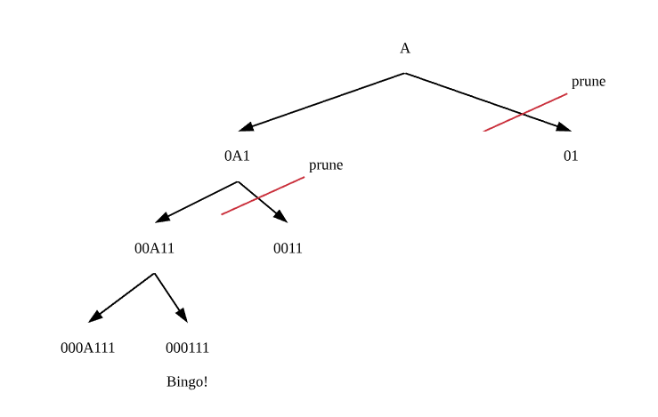

----------------------------------------------------------------------

> 注：前面所讲为查阅资料之前的想法

在阅读了几篇文献后，发现这样做（文法类的建立）虽然可行，但具有以下不足：

* 定义剪枝条件：如上图，运用A→01推导，因为此时没有A，无法再“延长”字符串以达到要求，但这是文法类做的事情么。如果产生式改变，这个推到条件又得变化了，如0A1→A，要求“缩短”，故无法达到整合处理的目的。
* 其实熟悉**状态机**后会发现，prune的子树回到了开始状态，如果转换成图，节省了判断剪枝条件，并且数据结构也变得简单。【这也是主流编译器通用的词法分析手段】

#### 状态机


引用一位博主在介绍状态机时举的例子【1】，我们日常生活中，灯关闭时，打开，为开启状态；再关闭，回到关闭状态；开启时同上。其实很多程序内部我们都用到了状态机的方法，只不过较为隐晦。

在状态有限的条件下，也就是常说的FSM（finite state machine)，对该方法最为直接的运用便是正则表达式。

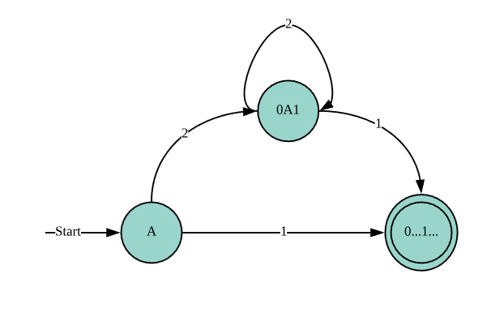

> 1 : A→01 ;   2 : A→0A1   ;  0...1...表示相同个数的0和1

 对于上方的状态转换可以该图描述。

#### 正则表达式

正则表达式，与用EBNF描述语法的形式颇有类似，及无二义性地对概念进行定义。

不过当前，很多主流语言如java，python，c++都对正则表达式有了充分支持，正则表达式只是描述，但最为核心的一点是，**任何的正则表达式都可以用FSM表示**，所以我们使用正则表达式进行字符串匹配的时候：

可以知道其实经过了以下步骤：

1. 将正则表达式转换成FSM
2. 生成FSM代码

FSM代码的思路通常为：

```
state = start_state
input = get_next_input
whilenotend of input do
  state = move(state, input)
  input = get_next_input
endif state is a final state
  return"ACCEPT"else return"REJECT"
```

所以第二步也是十分清晰的。


### 实现

摸着石头过河必定会花费大量时间，但有时候也是值得的，特别是想要思考来龙去脉的时候。但要进行实现的时候，参考前人的经验，既可以激发思绪，也可以节省大量尝试时间。想要搭建较为满意的编译器，采用现有的结构框架是一个很好的做法。

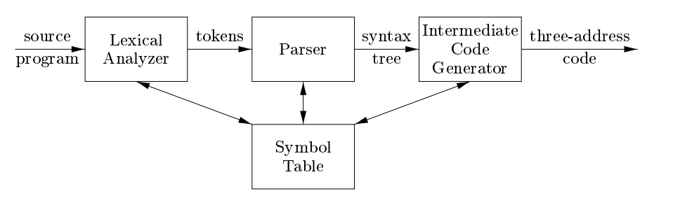

这是著名的Dragon Book[2](#引用文章) 中的编译器的前端模型，后面内容会继续引用该图：

目前，要做的为Lexical Analyzer，

主要功能用一句话概括为：读入输入流转化为tokens对象组。

#### 1.定义Tag类

```java
public enum Tag {
    ID("[a-zA-Z][[0-9]|[a-zA-Z]]*"),
    NUM("[0-9]+"),
    OPE("\\+|-|\\*|/|=|#|<|<=|>|>=|:="),
    DELIMITER("\\(|\\)|（|）|,|;|\\."),
    BASIC("begin|call|const|do|end|if|odd|procedure|read|then|var|while|write");

    public final String pattern;

    Tag(String pattern) {
        this.pattern = pattern;
    }
}
```

以描述tokens的类别

测试结果如下：（通过测试）

```java
 // NUM
        assertTrue(Pattern.matches(Tag.NUM.pattern, "555666600"));
        assertFalse(Pattern.matches(Tag.NUM.pattern, "555xe2"));
        // ID
        assertTrue(Pattern.matches(Tag.ID.pattern, "u123x"));
        assertFalse(Pattern.matches(Tag.ID.pattern, "12Uddd"));
        // OPE
        assertTrue(Pattern.matches(Tag.OPE.pattern, "+"));
        assertTrue(Pattern.matches(Tag.OPE.pattern, "-"));
        assertTrue(Pattern.matches(Tag.OPE.pattern, "*"));
        assertTrue(Pattern.matches(Tag.OPE.pattern, "/"));
        assertTrue(Pattern.matches(Tag.OPE.pattern, "="));
        assertTrue(Pattern.matches(Tag.OPE.pattern, ":="));
        assertTrue(Pattern.matches(Tag.OPE.pattern, "#"));
        assertTrue(Pattern.matches(Tag.OPE.pattern, "<="));
        assertTrue(Pattern.matches(Tag.OPE.pattern, ">="));
        // BASIC
        assertTrue(Pattern.matches(Tag.BASIC.pattern, "begin"));
        // DELIMITER
        assertTrue(Pattern.matches(Tag.DELIMITER.pattern, "）"));
        assertTrue(Pattern.matches(Tag.DELIMITER.pattern, "("));
        assertTrue(Pattern.matches(Tag.DELIMITER.pattern, ")"));
        assertTrue(Pattern.matches(Tag.DELIMITER.pattern, "（"));
        assertTrue(Pattern.matches(Tag.DELIMITER.pattern, ","));
        assertTrue(Pattern.matches(Tag.DELIMITER.pattern, ";"));
        assertTrue(Pattern.matches(Tag.DELIMITER.pattern, "."));
```

#### 2. UML类图

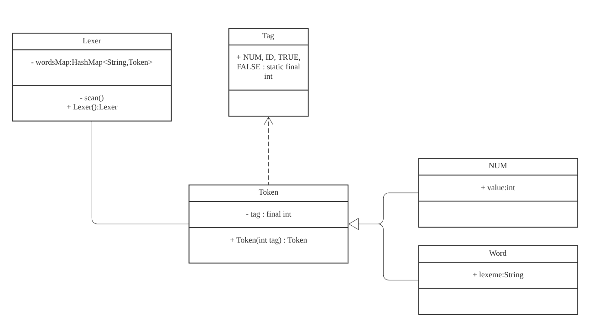

整个项目结构清晰，Lexer将输入的字符处理，主要用scan（）调用Tag中的NUM，与ID的识别方法，从而构建了相应的Token，并放入HashMap以存储字。

为了实验需要，有设置了一个专门统计Identifier的HashMap。

如此得到结果。

#### 3.一个关键问题

老师的测试数据任然不算严格，例如正常编译器中，有3+2>4，而非3 + 2 > 4, 这样规范的写法，如何识别连续输入的字符串呢？

这里Tag中的正则表达式发挥了作用：

1. 匹配所有满足表达式的结果并储存。
2. 字符串缩进，提高效率。

关键还是正则表达式，可见上方[Tag类定义](#正则表达式)。

### 测试用例结果

举一个例子，其余的请见测试resources文件夹：

case02.txt

```
CONST A=10;                  
VAR   B,C;                        
PROCEDURE  P;              
      VAR D;                        
      PROCEDURE  Q;       
           VAR X;           
           BEGIN
           	READ(X);
                D:=X;
                WHILE X#0       
                    DO CALL P;      
          END;
       BEGIN
        WRITE(D);
       CALL Q;
  END
BEGIN
 CALL P;
END.

```

result/case02Result.txt

```
(X: 4)
(D: 3)
(C: 1)
(B: 1)
(Q: 2)
(A: 1)
(P: 3)
```

可见结果正确。

我加入了注释功能，如java的// 与 /* */

测试用例：homework_1.txt

```
// 编写一个PL/O程序，输入3个正整数a、b、c，按从小到大的顺序输出这三个数
var a,b,c,t;
begin
    read(a);
    read(b);
    read(c);
    if a > b then
        begin
            t := b;
            b := a;
            a := t; 
        end
    if b > c then
        begin
            t := b;
            b := c;
            c := t; 
        end
    if a > c then
        begin
            t := a;
            a := c;
            c := t; 
        end
    begin
        write(a);
        write(b);
        write(c);
    end
end
```

结果：

```
(t: 7)
(a: 9)
(c: 9)
(b: 9)
```

### 后续工作

接下来就是变量表，文法，报错等内容，都留下了一些接口。总的来说，第一次工作量挺大，查资料，写代码，测试，整个周末都搭进去了，但收获明显：正则表达式，FSM，编译器基本框架。

## 词法分析

**一、实验目的：**                                           

1. 根据 PL/0 语言的 文法规范，编写 PL/0 语言的词法分析程序。

2. 通过设计调试词法分析程序，实现从源程序中分出各种单词的方法；加深对课堂教学的理解；提高词法分析方法的实践能力 。

3. 掌握从源程序文件中读取有效字符的方法和产生源程序的内部表示文件的法。

4. 掌握词法分析的实现方法。

5. 上机调试编出的词法分析程序。

**二、实验内容：**

输入PL/0语言程序，输出程序中各个单词符号（关键字、专用符号以及其它标记）。

**三、实验要求：**

1. 确定编译中单词种类、使用的表格、标识符与关键字的区分方法等。

2. 词法分析器读入PL/0语言源程序（文本文件），识别结果也以文本文件保存。

3. 词法分析器的输出形式采用二元式序列，即：

(单词种类,单词的值)

4. 源程序中字符不区分大小写，即：“a1”和“A1”是同一个标识符。

5. 准备至少5组测试用例，每组测试用例包括：输入源程序文件和输出结果。

6. 测试用例必须包含所有的基本字、运算符、界符、以及各种标识符和常数。对不合法单词进行分类考虑测试用例，特别是对一些运算。

**四、实验过程：**

1. 设计思路 

   在上一个步骤中，已经基本实现了词法分析，即将一段源代码作为输入，能够正确区分词的类型。这一步是对[上面](#1.定义Tag类)的补充。

   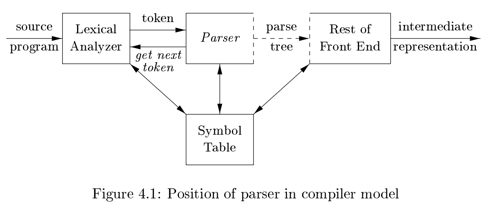

   由于上次对Lexical Analyzer的功能有少许误解，这次修改scan（）功能，以只得到一个套接字。以方便后续Parser的编写。

   修改后的设计UML类图如下：

   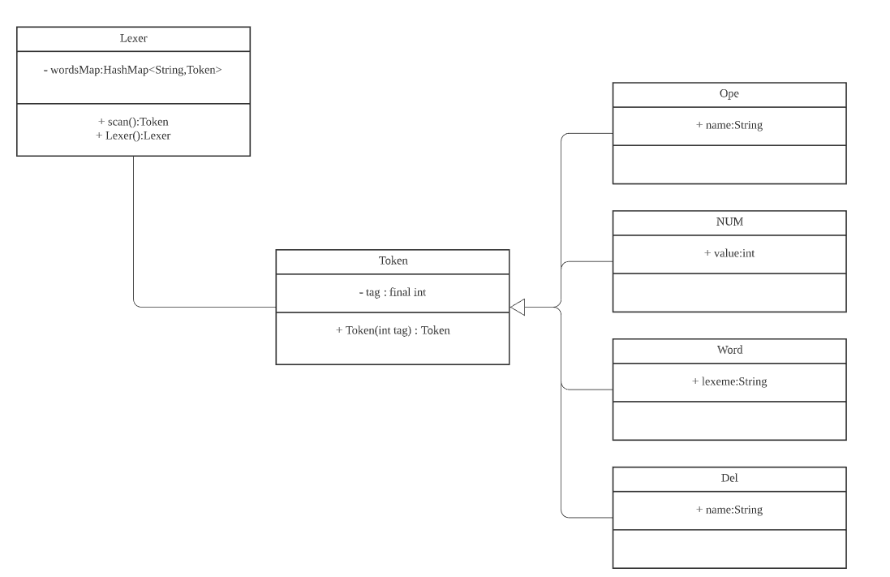

2. 实验结果

举一个例子：case01.txt

```java
var

    x,y,z;

begin

    x := 10;

    y := -5;

    read(z);

    if z > 3 then

        write(x)

    else

        write(y);

end.

```

结果：

```
(VAR, var)
(ID, X)
(Del, comma)
(ID, Y)
(Del, comma)
(ID, Z)
(Del, semicolon)
(BEGIN, begin)
(ID, X)
(OPE, becomes)
(NUM, 10)
(Del, semicolon)
(ID, Y)
(OPE, becomes)
(OPE, minus)
(NUM, 5)
(Del, semicolon)
(READ, read)
(Del, lParen)
(ID, Z)
(Del, rParen)
(Del, semicolon)
(IF, if)
(ID, Z)
(OPE, greaterThan)
(NUM, 3)
(THEN, then)
(WRITE, write)
(Del, lParen)
(ID, X)
(Del, rParen)
(ELSE, else)
(WRITE, write)
(Del, lParen)
(ID, Y)
(Del, rParen)
(Del, semicolon)
(END, end)
(Del, period)

```

 

**五、结论及体会：**

​    	此次实验较为简单，但然我弄明白了基本的词法分析的功能，每次一个套接字，比起多个一起识别，还稍微复杂一点，因为没有了Pattern 这样方便的道具。

## 语法分析

**一、实验目的：**                                           

1. 实验目的 

* 给出 PL/0 文法规范，要求编写 PL/0 语言的语法分析程序。
* 通过设计、编制、调试一个典型的语法分析程序，实现对词法分析
  程序所提供的单词序列进行语法检查和结构分析，进一步掌握常用
  的语法分析方法。
* 选择一种语法分析方法（递归子程序法、LL(1)分析法、算符优先分
  析法、SLR(1)分析法）；选择常见程序语言都具备的语法结构，如赋
  值语句，特别是表达式，作为分析对象。

**二、实验内容：**

* 已给 PL/0 语言文法，构造表达式部分的语法分析器。

* 分析对象〈算术表达式〉的 BNF 定义如下：
  <表达式> ::= [+|-]<项>{<加法运算符> <项>}
  <项> ::= <因子>{<乘法运算符> <因子>}
  <因子> ::= <标识符>|<无符号整数>| ‘(’<表达式>‘)’
  <加法运算符> ::= +|-
  <乘法运算符> ::= *|/

  学有余力的同学，可适当扩大分析对象。譬如： 
  ① 除表达式（算术表达式）外，扩充对条件表达式的语法分析。
  ② 表达式中变量名可以是一般标识符，还可含一般常数、数组元素、
  函数调用等等。
  ③ 加强语法检查，尽量多和确切地指出各种错误。
  ④ 直接用 PL/0 表达式源语言作为输入，例如: （a+15）*b 作为输
  入。

**三、实验要求：**

* 确定语法分析的方法。

* 将实验二“词法分析”的输出结果，作为表达式语法分析器的输入，
  进行语法解析，对于语法正确的表达式，报告“语法正确”；

* 对于语法错误的表达式，报告“语法错误”， 指出错误原因。
* 源程序中字符不区分大小写，即：“a1”和“A1”是同一个标识符。
* 准备至少 10 组测试用例，每组测试用例包括：输入文件和输出结果。

**四、实验过程：**

### Big Picture


引用Dragon Book[2](#引用文章) ，这一张图展示了Parser的两个主要功能

* 最重要的功能，即建立语法分析树，从Lexical Analyzer中取出token。【注：不一定是树结构】
* 维护标识符表，不同的函数生命周期中依次建立一张表，对程序中的变量进行查找和改写。

当然，作为附加功能，检查语法功能可以作为Parser的附加项。

### 解析算法

构造语法树解析语法，有如通用算法，Top Down，以及Bottom Up。通用算法如Cocke-Younger-Kasami
algorithm 和 Earley's algorithm几乎可以解析任何语法。我选择构造LL语法解析器，其原因主要有：

1. LL语法固然有一定局限，例如进能够识别满足LL语法规则的句子，但已足以面对大多数情况。
2. LL实现简单，有利于手工实现。
3. 方便自己复习已经学过的知识，加深印象

基于以上原因，我选择了LL。

LL的主要功能就是预测，计算FLLOW, FIRST, SELECT 集为节点下行选择提供判定基础。

* FIRST

  $FIRST(\alpha)$表示以$\alpha$开头的开始符号集[2]：(仅限下一选择的所有可能项)
  $$
  FIRST(\alpha) = \{a|\alpha\xrightarrow*a\beta,a\in V_T,\alpha,\beta\in V^*\}
  $$
  算法：

  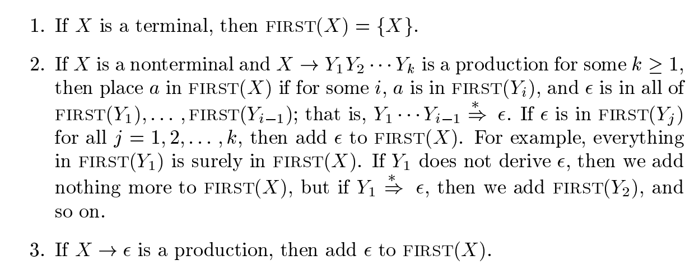

* FOLLOW

  $FOLLOW(A)$表示以开A头的后跟符号集[2]（同理）

$$
  FOLLOW(A) = \{a|\mu A\beta 且a\in V_T,a\in FIRST(\beta),\mu\in V^*_T,\beta\in V^+\}
$$


  一张图可以清晰的理解这两个概念上的差别。

  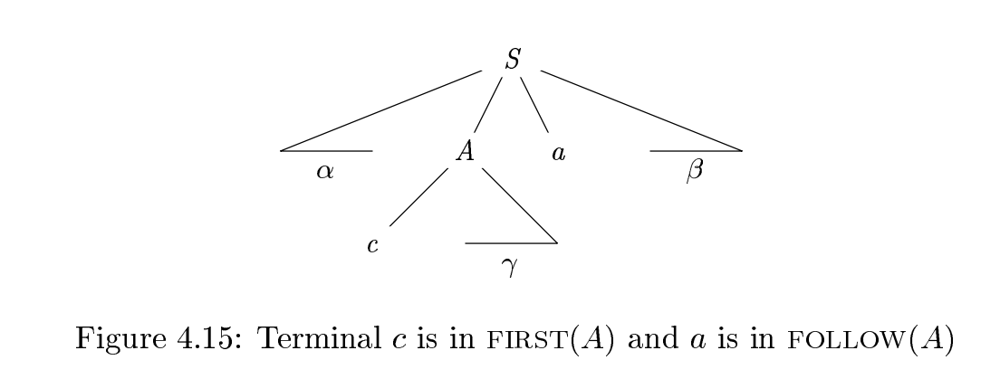

有点像DFS（深度优先遍历）与BFS(广度优先遍历)，只不过不同的是这里的作用是预测A之后的行径，那么关注点限制了范围，即A的子孙节点，以及兄弟节点（仅右方）；或许A，a之间还有一些点，但都会被消掉（$\epsilon$），假如a是下一个要取得话。

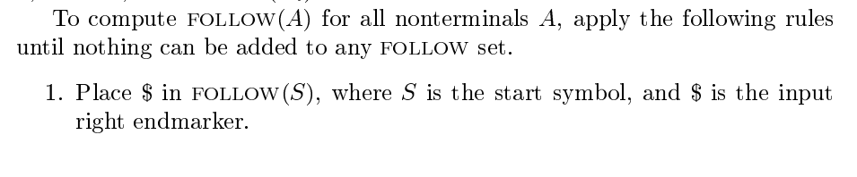

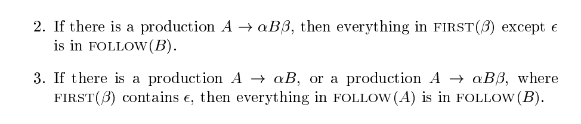

* SELECT

对于上下文无关文法产生式：$A\to \alpha,A\in V_N,\alpha\in V^*,若\alpha\nRightarrow \epsilon，则SELECT(A\to \alpha) = FIRTST(\alpha)$

$若\alpha\Rightarrow \epsilon，则SELECT(A\to \alpha) = FIRTST(\alpha-\{\epsilon\}))\cup FOLLOW(A)$

### 构建转换表

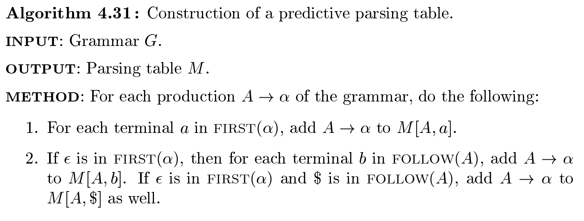

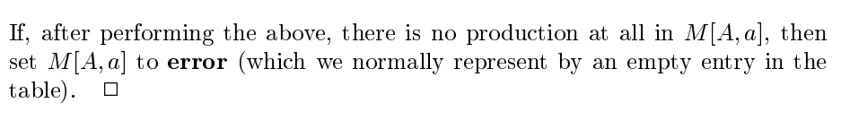

如果用树来表示的话，即是首先DFS遍历，如果没找到下一个，那么进行BFS，如果BFS还没找到，说明不符合LL语法。

### 预测算法实现

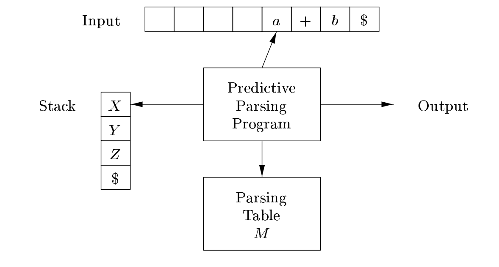

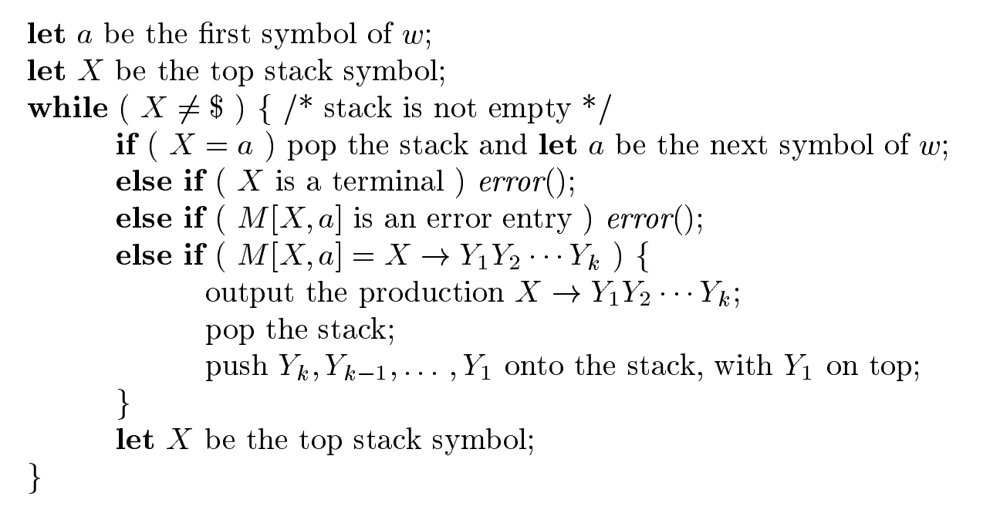

好了，基本的思路有了，但是在正式开始之前，还有一个基本的问题没有解决，因为用户输入的语法规则，毕竟不一定对LL语法是适合的，还需要包括消除左递归，提取左公因子，消除不确定性。

### 语法输入优化

虽然有消除歧义性这一项，在Dragon Book中，但是就课本上的内容而言，是没有的。歧义的产生，大多是If ELSE语句的不规范写法而照成的；PLO中没有else语句，故暂时不做。下面仅进行左递归的消除，左公因子的提取，即将某些不适应于LL语法的表达进行转换。

【DDL近了，优化暂时放一放，框架已经写好了】

#### 消除左递归

对于$A \xrightarrow+ A\alpha\space|\space\beta$:

替换作：

$A\to A^`\beta$

$A^`\to \alpha A^`\space|\epsilon$

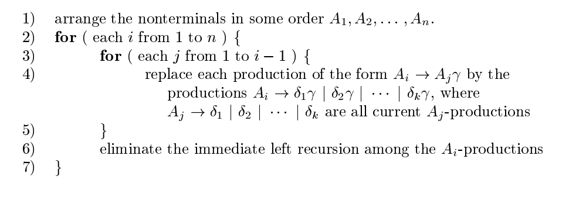

第6行消除直接递归，前面为间接递归。

#### 提取左公因子

对形如$A\to \alpha\beta\space|\space\alpha\gamma$ 转换为：

$A\to \alpha (\beta\space|\space\gamma) $

写作：

$A\to \alpha A^`,A^`\to\beta\space|\space\gamma$

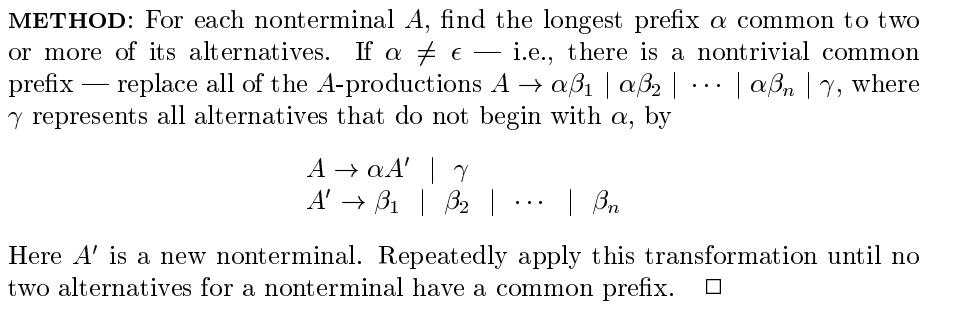

#### 项目UML类图

 

详细请看附件。

### 实现

1. 语法产生式定义：

   <表达式> ::= [+|-]<项>{<加法运算符> <项>}

   <项> ::= <因子>{<乘法运算符> <因子>}
   <因子> ::= <标识符>|<无符号整数>| ‘(’<表达式>‘)’
   <加法运算符> ::= +|-
   <乘法运算符> ::= *|/

   ----

   E -> AIB

   I -> FC

   F ->   D<标识符>|N<无符号整数>|(E)

   P ->  +|-

   M -> *|/

   A -> P| $\epsilon$

   B -> P I B |  $\epsilon$

   C ->   M F C |  $\epsilon$

#### FIRST集

这个写了我将近两天，因为实现的时候才发现内部具有递归，而且还需要考虑空这个恼人的玩意，还有对于递归过程中临时的HashSet以实现打表，减少已经做好的操作，另一个HashSet实现合并后表达式的FIRST集合记录。

```java
 /**
 *  Use after making every index decide one production
 *  Recursively check NonTerminal t's targets, and find the NonTerminals and add with hashmap to save and facilitate.
 *
 * @param production production to observe
 * @param tmpFirstSet results
 * @return has empty?
 */
   private boolean checkNonTerminal(Production production, Set<Token> tmpFirstSet) {
        // firstSet(not cleaned)
        HashSet<Token> firstSet = new HashSet<>();
        // terminal itself
        if (isTer(production.index)) {
            tmpFirstSet.add(production.index);
            return false;
        }
        // index is not terminal if there is one in first set map, then skip
        if (first.containsKey(production.index)) {
            // firstSet add
            firstSet.addAll(first.get(production.index));
            // empty map
            return firstEmpty.get(production.index);
        }
        boolean pEmpty = false;

        // clean first check target, all productions with the same index
        for (Vector<Token> tokens : production.target) {
            // check a certain production

            int emptyNum = 0;
            // check every possible token for a given production
            for (Token token : tokens) {
                // only A -> #
                if (token.context.equals("#")) {
                    tmpFirstSet.add(token);
                    firstSet.add(token);
                    pEmpty = true;
                    // go on
                    continue;
                }
                if (isTer(token)) {
                    // the token deduces terminal add to firstSet
                    tmpFirstSet.add(token);
                    firstSet.add(token);
                    // then break the loop and check another production if there is one
                    break;
                } else {
                    // nonTerminal and cannot deduce empty if it's in the map
                    Set<Token> tmp = first.get(token.toNonTerminal());
                    if (tmp != null) {
                        if (tmp.contains(new Token("#"))) {
                            pEmpty = true;
                        }
                        tmpFirstSet.addAll(tmp);
                        firstSet.addAll(tmp);
                         // check if it contains empty, yes -> go on, no-> break;
                        if(!(tmpFirstSet.contains(new Token("#")))){
                            // clean tmp
                           tmpFirstSet.clear();
                           break;
                       }
                    
                       // clean tmp
                       tmpFirstSet.clear();
                    } else {
                        Production p_ = productions.get(token.toNonTerminal());
                        pEmpty = checkNonTerminal(p_, tmpFirstSet);
                        // add tmpFirstSet to FirstSet before removing tmpFirstSet for next input
                        firstSet.addAll(tmpFirstSet);
                                // check if it contains empty, yes -> go on, no-> break;
                        if(!(tmpFirstSet.contains(new Token("#")))){
                            // clean tmp
                           tmpFirstSet.clear();
                           break;
                       }
                    
                       // clean tmp
                       tmpFirstSet.clear();
                        // clean tmp
                        tmpFirstSet.clear();
                    }
                    if (pEmpty) {
                        emptyNum++;
                        // remove empty as there is a choice and it's not the first level
                        tmpFirstSet.remove(new Token("#"));
                        firstSet.remove(new Token("#"));
                    }
                }
            }
            // when all choices contain a empty
            if (emptyNum == tokens.size()) {
                tmpFirstSet.add(new Token("#"));
                firstSet.add(new Token("#"));
            }

        }
        // add to first map
        first.put(production.index, firstSet);
        // clean for next
        firstEmpty.put(production.index, pEmpty);
        return pEmpty;
    }
```

#### FOLLOW集

```java
 /**
     * getFirst() should be used for calling this Start index given '!' as the
     * parentheses,'#' as empty
     */
    public void getFollow() {
        assert (!first.isEmpty());
        boolean changed = false;
        do {
            // update status
            followSetChanged = new HashMap<>();
            // start '!'
            Set<Token> s = follow.get(grammar.getStartToken());
            if (s == null) {
                s = new HashSet<>();
            }
            s.add(new Token("!"));
            follow.put(grammar.getStartToken(), s);
            // production with index k
            for (Entry<NonTerminal, Production> e : productions.entrySet()) {
                NonTerminal k = e.getKey();
                // index set
                Set<NonTerminal> keySet = first.keySet();
                Production v = e.getValue();
                // a production
                for (Vector<Token> production : v.target) {
                    // a token
                    for (int i = 0; i < production.size(); i++) {
                        Token t = production.get(i);
                        // only for keySet
                        if (keySet.contains(t.toNonTerminal())) {
                            // remember to change the type of equal()will get wrong.
                            NonTerminal tt = t.toNonTerminal();
                            // check i last one
                            if (i == production.size() - 1) {
                                Set<Token> set = follow.get(tt);
                                if (set == null) {
                                    set = new HashSet<>();
                                }
                                Set<Token> stmp = follow.get(k);
                                if (stmp == null) {
                                    stmp = new HashSet<>();
                                }
                                // record
                                followSetChanged.put(tt, set.addAll(stmp));
                                follow.put(tt, set);
                            } else {
                                // terminal next
                                Token n = production.get(i + 1);
                                if (isTer(n)) {
                                    Set<Token> set = follow.get(tt);
                                    if (set == null) {
                                        set = new HashSet<>();
                                    }
                                    // record
                                    followSetChanged.put(tt, set.add(n));
                                    follow.put(tt, set);
                                    // nonTerminal
                                } else {
                                    // next
                                    Set<Token> set = first.get(n.toNonTerminal());
                                    Set<Token> stmp = follow.get(tt);
                                    if (stmp == null) {
                                        stmp = new HashSet<>();
                                    }
                                    // if there's empty
                                    if (set.contains(new Token("#"))) {
                                        // add follow index
                                        Set<Token> tmp = follow.get(k);
                                        if (tmp == null) {
                                            tmp = new HashSet<>();
                                        }
                                        set.addAll(tmp);
                                    }
                                    // for(Iterator<Token> iterator = set.iterator();iterator.hasNext();){ Token
                                    // token = iterator.next(); if(token.context == "#"){
                                    // iterator.remove(); } } I leave the code here to suggest that iterator
                                    // will remove everything from source[HashMap first] be careful filter not empty
                                    Set<Token> tmp = new HashSet<>();
                                    for (Token token : set) {
                                        if (token.context != "#")
                                            tmp.add(token);
                                    }
                                    set = tmp;
                                    // record
                                    followSetChanged.put(tt, stmp.addAll(set));
                                    follow.put(tt, stmp);
                                }
                            }
                        }
                    }
                }

            }

            // get changed
            changed = followSetChanged.containsValue(true);
        } while (changed);
    }
```


#### SELECT集

```java
    /**
     * should make sure getFirst and getFollow are done before.
     */
    public void getSelect() {
        assert (!first.isEmpty() && !follow.isEmpty());
        // iterate all productions
        productions.forEach((k, v) -> {
            // split productions
            v.target.forEach(p -> {
                // check if the target production is empty
                HashSet<Token> firstSet = new HashSet<>();
                Set<Token> tmpFirstSet = new HashSet<>();
                Production pNew = new Production(k, p);
                boolean isEmpty = checkProductionFirst(firstSet, tmpFirstSet, pNew);
                if (isEmpty) {
                    firstSet.remove(new Token("#"));
                    firstSet.addAll(follow.get(k));
                }
                select.put(pNew, firstSet);
            });

        });
    }
```


我用书上的P72页例题4.5文法，P92 的例题测试，得到所有的结果皆通过。

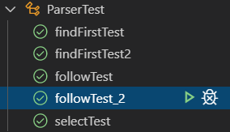

其中一个测试用例：

```java
 @Test
    void followTest_2() throws Exception {
        // Page 93
        String test = "E TA;A +TA;A #;T FB;B *FB;B #;F i;F (E)";
        Grammar grammar = new Grammar(new NonTerminal("E"), Production.translate(test));
        parser = new Parser(grammar);
        parser.getFirst();
        parser.getFollow();
        HashMap<NonTerminal, Set<Token>> follow = parser.follow;
        assertEquals(new HashSet<>(Arrays.asList(new Token("!"),new Token(")"))), 
        follow.get(new NonTerminal("E")), "first set fails.");
        
        assertEquals(new HashSet<>(Arrays.asList(new Token(")"),new Token("!"))), 
        follow.get(new NonTerminal("A")), "first set fails.");

        assertEquals(new HashSet<>(Arrays.asList(new Token("+"),new Token("!"),new Token(")"))), 
        follow.get(new NonTerminal("B")), "first set fails.");
    }
```

### 测试

输入测试用例

```
（a+15）*b
```

<表达式> ::= [+|-]<项>{<加法运算符> <项>}

<项> ::= <因子>{<乘法运算符> <因子>}
<因子> ::= <标识符>|<无符号整数>| ‘(’<表达式>‘)’
<加法运算符> ::= +|-
<乘法运算符> ::= *|/

----

E -> AIB

I -> FC

F ->   D<标识符>|N<无符号整数>|(E)

P ->  +|-

M -> *|/

A -> P| $\epsilon$

B -> P I B |  $\epsilon$

C ->   M F C |  $\epsilon$

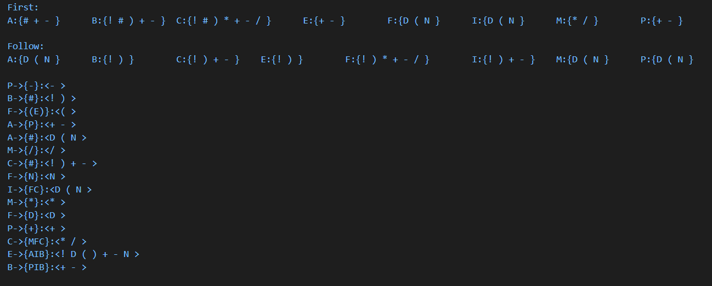

测试通过！

## 语义分析

1. 实验目的 

* 通过上机实习，加深对语法制导翻译原理的理解，掌握将语法分析
  所识别的语法范畴变换为某种中间代码的语义翻译方法。
* 掌握目前普遍采用的语义分析方法──语法制导翻译技术。
* 给出 PL/0 文法规范，要求在语法分析程序中添加语义处理，对于语
  法正确的算术表达式，输出其计算值。 

**二、实验内容：**

* 已给 PL/0 语言文法，在表达式的语法分析程序里，添加语义处理部分。


**三、实验要求：**

* 语义分析对象重点考虑经过语法分析后已是正确的语法范畴，实习
  重点是语义子程序。
* 在实验三“语法分析器”的里面添加 PL/0 语言“表达式”部分的语
  义处理。
* 计算表达式的语义值。
* 准备至少 10 组测试用例，每组测试用例包括：输入文件和输出结果。

**四、实验过程：**

UML类图

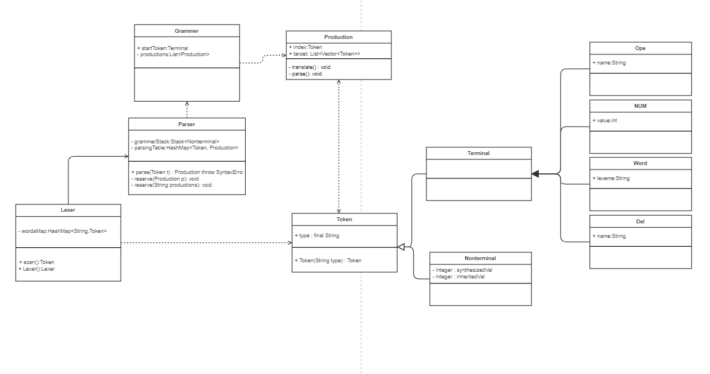

在前面的基础上加入这两个部分：


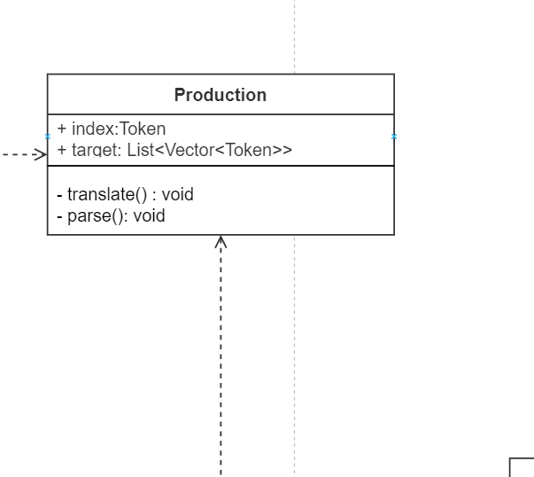

加入parse（）函数，定义语义动作，而对于非终结符给与综合属性与继承属性，终结符仅综合属性。

目前仅对于算术表达式的语义分析进行实现，如下所示，该函数为parse（）函数中的一个部分。

```java
public static double eval(final String str,Map<Word,Double> variables) {

        return new Object() {
            int pos = -1, ch;
    
            void nextChar() {
                ch = (++pos < str.length()) ? str.charAt(pos) : -1;
            }
    
            boolean eat(int charToEat) {
                while (ch == ' ') nextChar();
                if (ch == charToEat) {
                    nextChar();
                    return true;
                }
                return false;
            }
    
            double parse() {
                nextChar();
                double x = parseExpression();
                if (pos < str.length()) throw new RuntimeException("Unexpected: " + (char)ch);
                return x;
            }
    
            // Grammar:
            // expression = term | expression `+` term | expression `-` term
            // term = factor | term `*` factor | term `/` factor
            // factor = `+` factor | `-` factor | `(` expression `)`
            //        | number | functionName factor | factor `^` factor
    
            double parseExpression() {
                double x = parseTerm();
                for (;;) {
                    if      (eat('+')) x += parseTerm(); // addition
                    else if (eat('-')) x -= parseTerm(); // subtraction
                    else return x;
                }
            }
    
            double parseTerm() {
                double x = parseFactor();
                for (;;) {
                    if      (eat('*')) x *= parseFactor(); // multiplication
                    else if (eat('/')) x /= parseFactor(); // division
                    else return x;
                }
            }
    
            double parseFactor() {
                if (eat('+')) return parseFactor(); // unary plus
                if (eat('-')) return -parseFactor(); // unary minus
    
                double x;
                int startPos = this.pos;
                if (eat('(')) { // parentheses
                    x = parseExpression();
                    eat(')');
                } else if ((ch >= '0' && ch <= '9') || ch == '.') { // numbers
                    while ((ch >= '0' && ch <= '9') || ch == '.') nextChar();
                    x = Double.parseDouble(str.substring(startPos, this.pos));
                } else if(Character.isLetterOrDigit(ch)){ // words predefined
                    int tmp = this.pos;
                    while(Character.isLetterOrDigit(ch)) nextChar();
                    String words = str.substring(startPos, this.pos);
                    //find 
                    if(variables.containsKey(new Word(words))){
                        x = variables.get(new Word(words));
                    }
                    // back
                    else{
                        pos = tmp;
                        x = (Double) null;
                    }
                }else if (ch >= 'a' && ch <= 'z') { // functions
                    while (ch >= 'a' && ch <= 'z') nextChar();
                    String func = str.substring(startPos, this.pos);
                    x = parseFactor();
                    if (func.equals("sqrt")) x = Math.sqrt(x);
                    else if (func.equals("sin")) x = Math.sin(Math.toRadians(x));
                    else if (func.equals("cos")) x = Math.cos(Math.toRadians(x));
                    else if (func.equals("tan")) x = Math.tan(Math.toRadians(x));
                    else throw new RuntimeException("Unknown function: " + func);
                } 
                
                else {
                    throw new RuntimeException("Unexpected: " + (char)ch);
                }
    
                if (eat('^')) x = Math.pow(x, parseFactor()); // exponentiation
    
                return x;
            }
        }.parse();
    }
```

结果测试：


验证一下： （0.213+15）*0.4 = 6.0852

在这个equal（）中，我加入了从论坛借鉴的字符串解析，如tan，sin，cos，sqrt均可实现：

测试：如((4 - 2^3 + 1) * -sqrt(3*3+4*4)) / 2 答案为7.5

```java
 HashMap<Word,Double> wordMap = new HashMap<>();
          wordMap.put(new Word("a"), 0.213);
          wordMap.put(new Word("b"), 0.4);
          double res = Production.eval("(a+15)*b",wordMap); 
          assertEquals(6.0852, res);
          res = Production.eval("((4 - 2^3 + 1) * -sqrt(3*3+4*4)) / 2",wordMap); 
          assertEquals( 7.5 , res);
```

后续需要将eval（）部分并入parse（）中，以解析赋值，if（）等其他语句。

##  中间代码生成

本章是最后一次实验了，从最开始搭建PLO到现在，也过了一学期的时间，其中还有许多功能未能实现，略有遗憾。选择中间代码生成实验，也是因为想按照顺序吧！【非常希望这套实验能成为期末考试的题目】总的来说，我从基本的数据结构出发，参考了经典读物实现了编译器的主要功能，包括词法分析，语法解析，语义分析；感觉到编译原理，是一个计算机读懂语言的过程，希望今后能从中受益！

1. 实验目的 

  * 通过上机实习，加深对语法制导翻译原理的理解，掌握将语法分析
    所识别的语法范畴变换为某种中间代码的语义翻译方法。
  * 掌握目前普遍采用的语义分析方法──语法制导翻译技术。
  * 给出 PL/0 文法规范，要求在语法分析程序中添加语义处理，对于语法正确的表达式，输出其中间代码。

2. 实验内容 

   * 已给 PL/0 语言文法，在实验三的表达式语法分析程序里，添加语义处理部分输出表达式的中间代码，用四元式序列表示。

3. 实验要求 

  * 在实验三“语法分析器”的里面添加 PL/0 语言“表达式”部分的语
    义处理，输出表达式的中间代码。
  * 中间代码用四元式序列表示。
  * 准备至少 10 组测试用例，每组测试用例包括：输入文件和输出结果。

4. 实验过程

   

   在原有的Production类语义分析中，加入记录四元式的成分：（quaternary）

   

   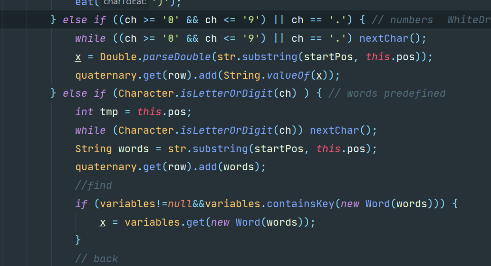

这个代码片段是记录word的，即标识符；而在对于操作符的记录：

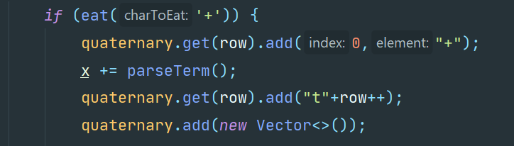

实现了记录并且开启下一行，因为一个记录符号即代表一个二元运算的解析，所以要为下一次的替换做好准备：

* 测试结果如下

  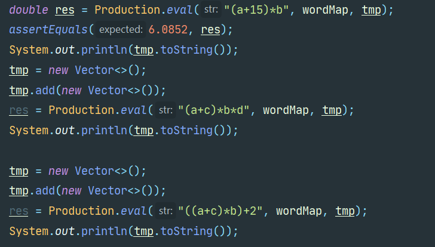

输出结果：

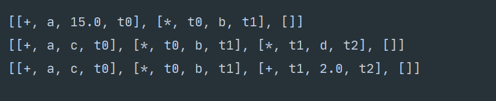

## 引用文章

[1] : by Eli Bendersky, 2003.  http://archive.gamedev.net/archive/reference/programming/features/af1/index.htmlCopyright 

[2] : Dragon Book, Aho, Sethi, Ullman, *Compilers: Principlesbiaoshi, Techniques, and Tools*, Addison-Wesley, 1986. [ISBN](https://en.wikipedia.org/wiki/International_Standard_Book_Number) [0-201-10088-6],2ed.


## 附录

### EBNF 的元符号

 ‘< >’  是用左右尖括号括起来的中文字表示语法构造成分，或称语法单位，为非终结符。

   ‘::=’ 该符号的左部由右部定义，可读作‘定义为’

   ‘|’ 表示‘或’，即左部可由多个右部定义

   ‘{ }’ 表示花括号内的语法成分可以重复；在不加上
     下界时可重复0到任意次数，有上下界时为可重复次
     数的限制

   ‘[ ]’ 表示方括号内的成分为任选项

   ‘( )’ 表示圆括号内的成分优先


### PL/0 语言文法的 EBNF

<程序>::=<分程序>.
<分程序> ::=【<常量说明>】[<过程说明>]<语句>
<常量说明> ::=CONST<常量定义>{， <常量定义>};
<常量定义> ::=<标识符>=<无符号整数>
<无符号整数> ::= <数字>{<数字>}
<变量说明> ::=VAR <标识符>{, <标识符>};
<标识符> ::=<字母>{<字母>|<数字>}
<过程说明> ::=<过程首部><分程序>{; <过程说明> };
<过程首部> ::=PROCEDURE <标识符>;
<语句> ::=<赋值语句>|<条件语句>|<当循环语句>|<过程调用语句>
|<复合语句>|<读语句><写语句>|<空>
<赋值语句> ::=<标识符>:=<表达式>
<复合语句> ::=BEGIN <语句> {;<语句> }END
<条件表达式> ::= <表达式> <关系运算符> <表达式> |ODD<表达式>
<表达式> ::= [+|-]<项>{<加法运算符> <项>}
<项> ::= <因子>{<乘法运算符> <因子>}
<因子> ::= <标识符>|<无符号整数>| ‘(’<表达式>‘)’
<加法运算符> ::= +|-
<乘法运算符> ::= *|/
<关系运算符> ::= =|#|<|<=|>|>=
<条件语句> ::= IF <条件表达式> THEN <语句>
<过程调用语句> ::= CALL 标识符
<当循环语句> ::= WHILE <条件表达式> DO <语句>
<读语句> ::= READ‘(’<标识符>{,<标识符>}‘)’
<写语句> ::= WRITE‘(’<表达式>{,<表达式>}‘)’
<字母> ::= a|b|…|X|Y|Z
<数字> ::= 0|1|…|8|9  


### 类型、上下文约束与作用域规则

   数据类型只有整数类型

   数据结构只支持简单变量和常数

   所支持的数字为最长 9 位的十进制数

   标识符的有效长度为10

   标识符引用前先要声明

   过程无参数

   过程可嵌套，最多嵌套 3 层

   过程可递归调用

   内层过程可以引用包围它的外层过程的标识符


### PL/O语言的词汇表

| 序 号 | 类 别    | 单词                                                         | 编码                                                         |
| ----- | -------- | ------------------------------------------------------------ | ------------------------------------------------------------ |
| 1     | 基 本 字 | begin、 call、 const、 do、 end、 if、 odd、 procedure、 read、 then、 var、 while、 write | beginsym, callsym, constsym dosym, endsym, ifsym, oddsym proceduresym, readsym, thensym varsym, whilesym, writesym |
| 2     | 标 识 符 | ident                                                        |                                                              |
| 3     | 常 数    | number                                                       |                                                              |
| 4     | 运 算 符 | +、 -、 *、 /、 =、 #、 <、 <=、 >、 >=、 :=                 | plus, minus, times, slash, eql, neq, lss, leq, gtr, geq, becomes |
| 5     | 界 符    | （、 ）、 ， 、 ； 、 .                                      | Lparen, rparen, comma, semicolon period                      |

### ASCII


### JAVA SE 14

[Java® Platform, Standard Edition & Java Development Kit
Version 14 API Specification](https://docs.oracle.com/en/java/javase/14/docs/api/index.html)

[#词法分析]: 
[#定义Tag类]: 